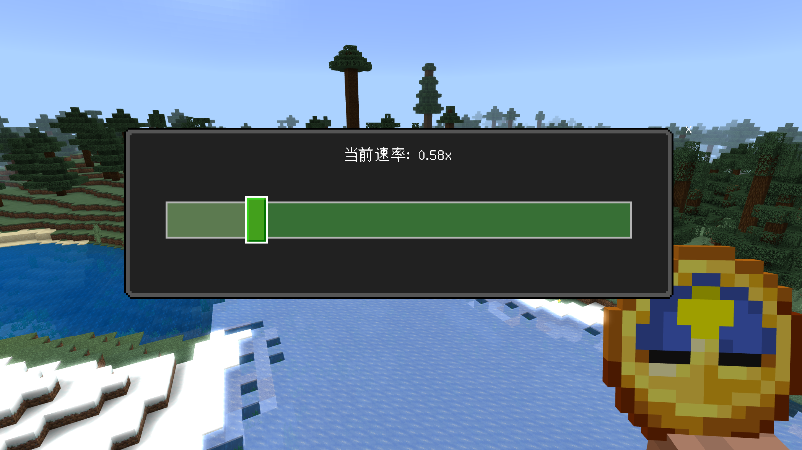

# QChronoHook
适用于 **网易我的世界基岩版** Windows的游戏时间变速实现。

## 使用方法
1. 将`mod`文件夹导入至`mcs`中运行；
2. 进入游戏后，右键时钟即可打开编辑界面；
3. 通过滑块调整时间流逝速度。

## 游戏画面

## 第三方依赖
- [MinHook](https://github.com/TsudaKageyu/minhook)
- [nlohmann/json](https://github.com/nlohmann/json)